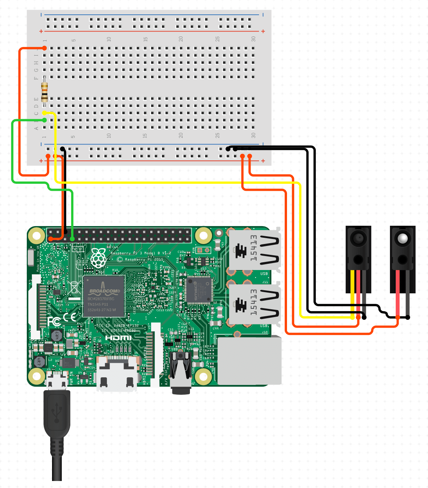
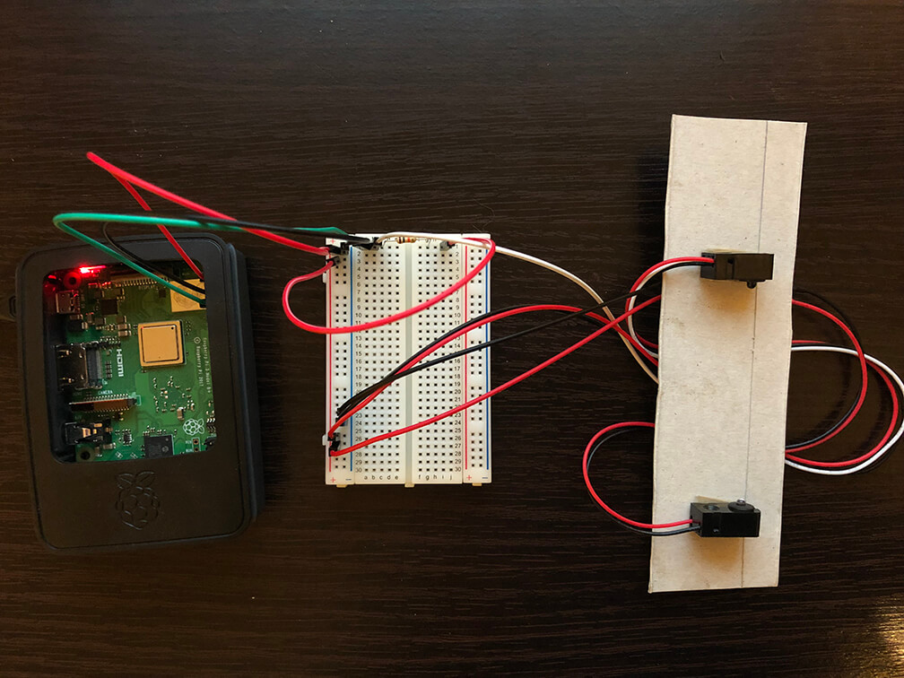

# Raspberry Pi Speed Sensor
A project to determine the speed in which an object travels between two break beam sensors using a Raspberry Pi

## Hardware used:
- [Raspberry Pi 3 Model B](https://www.raspberrypi.org/products/raspberry-pi-3-model-b/)
- [IR Break Beam Sensor - 3mm LEDs](https://thepihut.com/products/adafruit-ir-break-beam-sensor-3mm-leds)
- [Resistors - 10K ohm 5% 1/4W](https://thepihut.com/products/adafruit-through-hole-resistors-10k-ohm-5-1-4w-pack-of-25)

## 1 - But first
Before wiring up two sensors, a quick test to ensure that the wiring for one is correct and that a break in the beam can be detected.

### 1.1 - Setup
A clean and tidy view of what the wiring looks like:



Then the actual product



### 1.2 - Running the Python script
```
python break_beam_test.py
```

A line of text will be output when the beam is broken.

# TODO
- Wire the second sensor
- Write the Python script!
